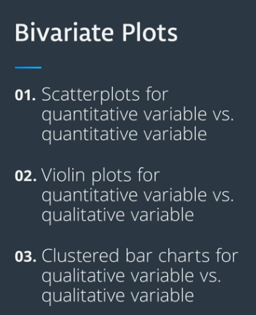

# Bivariate Exploration of Data

In this section, you will continue to develop your insights through Bivariate Visualizations. 
Bivariate Visualizations are those that involve two variables. We use Bivariate Visualizations to look at relationships when we change the level or value of one variable to see what kind of changes do we expect from the second?  

We will look at three major bivariate plots. 

* For quantitative versus quantitative variables, there are scatter plots. 

* For quantitative versus qualitative, we use violin plots. 

* For qualitative versus qualitative, we discuss clustered bar charts. 

 

  
 

 
# Scatterplots

If you want to inspect the relationship between two numeric variables, the standard choice of plot is the scatterplot. check this [notebook](https://github.com/A2Amir/Data-Visualization-in-Data-Science-Process/blob/master/Code/Scatterplots%20and%20Correlation.ipynb) to get more familiar with it.

# Overplotting, Transparency, and Jitter

If we have a very large number of points to plot or our numeric variables are discrete-valued, then it is possible that using a scatterplot straightforwardly will not be informative. The visualization will suffer from overplotting, where the high amount of overlap in points makes it difficult to see the actual relationship between the plotted variables. check this [notebook](https://github.com/A2Amir/Data-Visualization-in-Data-Science-Process/blob/master/Code/%20Overplotting%2C%20Transparency%2C%20and%20Jitter.ipynb) to get more familiar with it.

# Heat Maps

A heat map is a 2-d version of the histogram that can be used as an alternative to a scatterplot. Like a scatterplot, the values of the two numeric variables to be plotted are placed on the plot axes. Similar to a histogram, the plotting area is divided into a grid and the number of points in each grid rectangle is added up. check this [notebook](https://github.com/A2Amir/Data-Visualization-in-Data-Science-Process/blob/master/Code/Heat%20Maps.ipynb) to get more familiar with it.

# Violin Plots

There are a few ways of plotting the relationship between one quantitative and one qualitative variable, that demonstrate the data at different levels of abstraction. The violin plot is on the lower level of abstraction. For each level of the categorical variable, a distribution of the values on the numeric variable is plotted. . check this [notebook](https://github.com/A2Amir/Data-Visualization-in-Data-Science-Process/blob/master/Code/Violin%20Plots.ipynb) to get more familiar with it.

# Box Plots

A box plot is another way of showing the relationship between a numeric variable and a categorical variable. Compared to the violin plot, the box plot leans more on summarization of the data, primarily just reporting a set of descriptive statistics for the numeric values on each categorical level. check this [notebook](https://github.com/A2Amir/Data-Visualization-in-Data-Science-Process/blob/master/Code/Box%20Plots.ipynb) to get more familiar with it.

# Clustered Bar Charts
To depict the relationship between two categorical variables, we can extend the univariate bar chart into a clustered bar chart. Like a standard bar chart, we still want to depict the count of data points in each group, but each group is now a combination of labels on two variables.check this [notebook](https://github.com/A2Amir/Data-Visualization-in-Data-Science-Process/blob/master/Code/%20Clustered%20Bar%20Charts.ipynb) to get more familiar with it.

# Faceting

One general visualization technique that will be useful for you to know about to handle plots of two or more variables is faceting. In faceting, the data is divided into disjoint subsets, most often by different levels of a categorical variable. For each of these subsets of the data, the same plot type is rendered on other variables. Faceting is a way of comparing distributions or relationships across levels of additional variables, especially when there are three or more variables of interest overall. While faceting is most useful in multivariate visualization, it is still valuable to introduce the technique here in our discussion of bivariate plots.check this [notebook](https://github.com/A2Amir/Data-Visualization-in-Data-Science-Process/blob/master/Code/Faceting.ipynb) to get more familiar with it.

# Adapted Bar Charts

Histograms and bar charts can be adapted for use as bivariate plots, instead of indicating count by height, indicating a mean or other statistic on a second variable.check this [notebook](https://github.com/A2Amir/Data-Visualization-in-Data-Science-Process/blob/master/Code/Adapted%20Bar%20Charts.ipynb) to get more familiar with it.

# Adapted Histograms

Matplotlib's hist function can also be adapted so that bar heights indicate value other than a count of points through the use of the "weights" parameter.check this [notebook](https://github.com/A2Amir/Data-Visualization-in-Data-Science-Process/blob/master/Code/Adapted%20Histograms.ipynb) to get more familiar with it.

# Line Plots

The line plot is a fairly common plot type that is used to plot the trend of one numeric variable against values of a second variable.check this [notebook](https://github.com/A2Amir/Data-Visualization-in-Data-Science-Process/blob/master/Code/Line%20Plots.ipynb) to get more familiar with it.

# Q-Q plot
There might be cases where you are interested to see how closely your numeric data follows some hypothetical distribution. This might be important for certain parametric statistical tests, like checking for assumptions of normality. In cases like this, you can use **a quantile-quantile plot, or Q-Q plot**, to make a visual comparison between your data and your reference distribution.check this [notebook](https://github.com/A2Amir/Data-Visualization-in-Data-Science-Process/blob/master/Code/Q-Q%20Plots.ipynb) to get more familiar with it.

# Swarm Plots

Another alternative to Boxplot and Violin plots is the swarm plot depicting the relationship between a numeric variable and a categorical variable. Similar to a scatterplot, each data point is plotted with position according to its value on the two variables being plotted. check this [notebook](https://github.com/A2Amir/Data-Visualization-in-Data-Science-Process/blob/master/Code/Swarm%20Plots.ipynb) to get more familiar with it.

# Rug and Strip Plots

You might encounter marginal distributions that are plotted alongside bivariate plots such as scatterplots which named rug plots. In a rug plot, all of the data points are plotted on a single axis, one tick mark or line for each one. Another plot type similar to the rug plot is the strip plot. It's like a swarm plot but without any dodging or jittering to keep points separate or off the categorical line.
check this [notebook](https://github.com/A2Amir/Data-Visualization-in-Data-Science-Process/blob/master/Code/Rug%20and%20Strip%20Plots.ipynb) to get more familiar with it.

# Stacked Plots

The most basic stacked chart takes a single bar representing the full count, and divides it into colored segments based on frequencies on a categorical variable. If this sounds familiar, that's because it almost perfectly coincides with the description of a pie chart, except that the shape being divided is different.check this [notebook](https://github.com/A2Amir/Data-Visualization-in-Data-Science-Process/blob/master/Code/Stacked%20Plots.ipynb) to get more familiar with it.

# Ridgeline Plots

One of the hot new visualization types from recent years is the ridgeline plot. In a nutshell, the ridgeline plot is a series of vertically faceted line plots or density curves, but with somewhat overlapping y-axes. This can be thought of as a contrast to the line plot variation seen in the "Line Plots" part, where multiple lines were plotted on the same axes, with different hues. On this section, I'll walk through the creation of a ridgeline plot using some of the demonstration data shown in the "Faceting" section.check this [notebook](https://github.com/A2Amir/Data-Visualization-in-Data-Science-Process/blob/master/Code/Ridgeline%20Plots.ipynb) to get more familiar with it.
