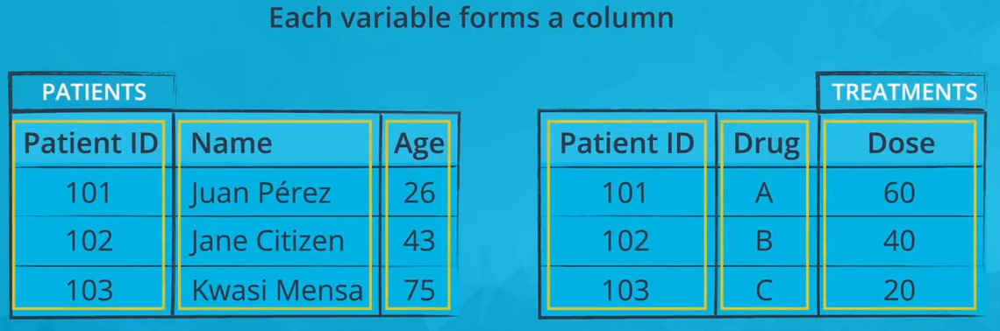
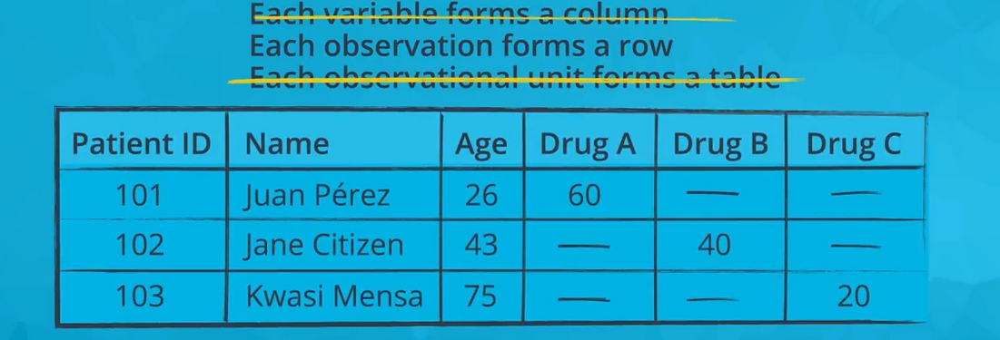

# Bivariate Exploration of Data

In this section, you will continue to develop your insights through Bivariate Visualizations. 
Bivariate Visualizations are those that involve two variables. We use Bivariate Visualizations to look at relationships when we change the level or value of one variable to see what kind of changes do we expect from the second?  

We will look at three major bivariate plots. 

* For quantitative versus quantitative variables, there are scatter plots. 

* For quantitative versus qualitative, we use violin plots. 

* For qualitative versus qualitative, we discuss clustered bar charts. 

 

  
 

                              
                                    Each variable in a tidy dataset must have its own column.
 
 

  
 

 
                                    Each observation in a tidy dataset must have its own row
 

  
 

 
                                    Each observational unit in a tidy dataset must have its own table

The next image depicts the same data but in one representation of a non-tidy format (there are other possible non-tidy representations). The Drug A, Drug B, and Drug C columns should form one 'Drug' column, since this is one variable. The entire table should be separated into two tables: a patients table and a treatments table.

 

  
 

 
Only the second rule of tidy data is satisfied in this non-tidy representation of the above data: each observation forms a row

While the data provided to you in the section will all be tidy, in practice, you may need to perform tidying work before exploration. You should be comfortable with reshaping your data or perform transformations to split or combine features in your data, resulting in new data columns. This work should be performed in the wrangling stage of the data analysis process.

**Notice: tidy data is not the only useful form that data can take.In fact, as you work with a dataset, you might need to summarize it in a non-tidy form in order to generate appropriate visualizations.**

# Bar Charts

A **bar chart** is used to depict the distribution of **a categorical** variable. In a bar chart, each level of the categorical variable is depicted with a bar, whose height indicates the **frequency of data points** that take on that level. A basic bar chart of frequencies can be created through the use of **seaborn's countplot** function check [this notebook](https://github.com/A2Amir/Data-Visualization-in-Data-Science-Process/blob/master/Code/Bar%20Charts.ipynb) to get more familiar.

