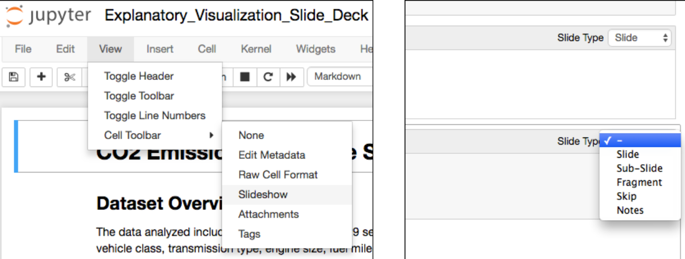

# Explanatory analysis

This section, we'll focus on explanatory analysis, which is done when you communicate your findings to others.
These visualizations need to emphasize the key messages that you want the viewer to understand. Compared to **exploratory plots**, explanatory plots should be polished
so that their purpose is clear and easy to obtain.

In **explanatory analyses**, your audience will be broader and your goal will be to convey your findings to other people who don't have the level of hands-on experience with the data as you. Visualizations under this banner should be focused on **telling a specific story** that you want to convey to that particular audience. Many times, these visualizations evolve from visuals created during **the exploratory process**, just polished up to highlight the specific intended insights. These highlights might change depending on the audience you're presenting to. You'll revisit those design concepts from earlier to make your plots informative not just for yourself, but also compelling and understandable for others.

**Telling stories with data follows these steps:**

1. Start with a Question
2.  Repetition is a Good Thing
3.  Highlight the Answer
4.  Call Your Audience To Action

# Polishing Plots

In order to convey your findings to others quickly and efficiently, you'll need to put work into polishing your plots. There are many dimensions to consider when putting together a polished plot.check this [notebook](https://github.com/A2Amir/Data-Visualization-in-Data-Science-Process/blob/master/Code/Polishing%20Plots.ipynb) to get more familiar.

# Creating a Slide Deck with Jupyter

check this [notebook]() to get more familiar.

There are many ways in which you can use explanatory visualizations to convey findings to others. You might save your plots on their own, and embed them in a report or blog post. Visualizations also have a major place in presentations, as part of a slide deck. When it comes to creating slides, you might normally think of dedicated tools like Powerpoint, Keynote, or Google Slides. What you might not be aware of is the fact that Jupyter notebooks include a tool, [nbconvert](https://nbconvert.readthedocs.io/en/latest/), that can export notebooks in an HTML slides format. 

If you're planning on creating a slide deck presentation through a Jupyter notebook, it's a good idea to create a new notebook that is separate from your original, exploratory, work. This way, your explanatory work will be focused, and there will be fewer elements to categorize. To start, you need to categorize the type of slide element that each cell will correspond with.As depicted below from **the menu bar**, select **View > Cell Toolbar > Slideshow**. You'll see a drop down appear in the upper right hand corner of each cell, from which you can assign slide element types.

 
 

  
 

 
 For cells that you want readers to see, you'll choose the Slide, Sub-Slide, or Fragment types. Slides will form the main flow of the presentation, while sub-slides are children of slides in the main flow. Fragments are attached to preceding slides or sub-slides, and allow for gradual reveals of information on the same slide. It's a little hard to describe this abstractly through text: you can see an example of Slides, Sub-Slides, and Fragments at work through the example presentation found on the [reveal.js](https://revealjs.com/) homepage (the library that is behind the nbconvert slide functionality).
