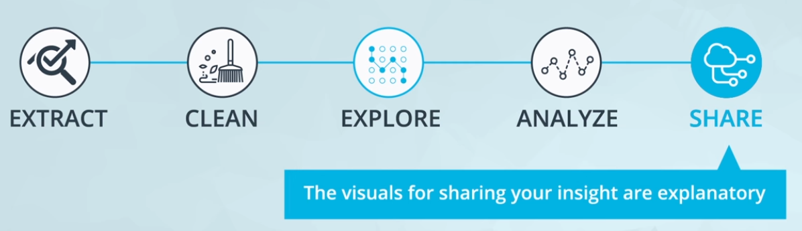

# Exploratory vs. Explanatory Analyses

There are two main reasons for creating visuals using data:

   * Exploratory analysis is done when you are searching for insights. These visualizations don't need to be perfect. You are using plots to find insights, but they don't need to be aesthetically appealing. You are the consumer of these plots, and you need to be able to find the answer to your questions from these plots.

        

        
        

   * Explanatory analysis is done when you are providing your results for others. These visualizations need to provide you the emphasis necessary to convey your message. They should be accurate, insightful, and visually appealing.
   
   
        

        
        

The five steps of the data analysis process:

   * Extract - Obtain the data from a spreadsheet, SQL, the web, etc.

   * Clean - Here we could use exploratory visuals.

   * Explore - Here we use exploratory visuals.

   * Analyze - Here we might use either exploratory or explanatory visuals.
   
   * Share - Here is where explanatory visuals live.

Below you can see the differrences between Exploratory and Explanatory analyses.

   
      

      
      

# Python Data Visualization Libraries

We will make use of the following libraries for creating data visualizations:

   * [Matplotlib](https://matplotlib.org/): a versatile library for visualizations, but it can take some code effort to put together common visualizations.
    
    
   * [Seaborn](https://seaborn.pydata.org/): built on top of matplotlib, adds a number of functions to make common statistical visualizations easier to generate.
    
   * [pandas](https://pandas.pydata.org/): while this library includes some convenient methods for visualizing data that hook into matplotlib, we'll mainly be using it for its main purpose as a general tool for working with data.

All together, these libraries will allow us to visualize data in a balance of productivity and flexibility, for both exploratory as well as explanatory analyses.

**A Quick Note about Library Versions:**

Some of the things that you see in this repo might not work the same depending on which version of the Python packages you have. For clarity, as of August 2018, here are the library versions that were used to create the repo materials:

  * NumPy: Workspaces use v1.12.1, content created with v1.14.0
  * pandas: Workspaces use v0.20.3, content created with v0.22.0
  * Matplotlib: Workspaces use v2.1.0, content created with v2.1.2
  * Seaborn: Workspaces and content both created with v0.8.1

