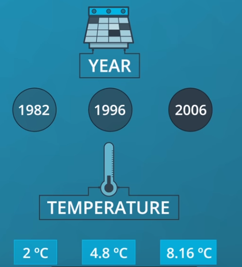
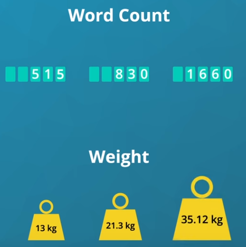
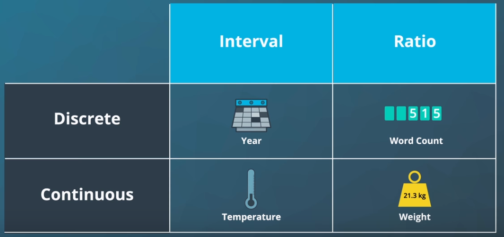
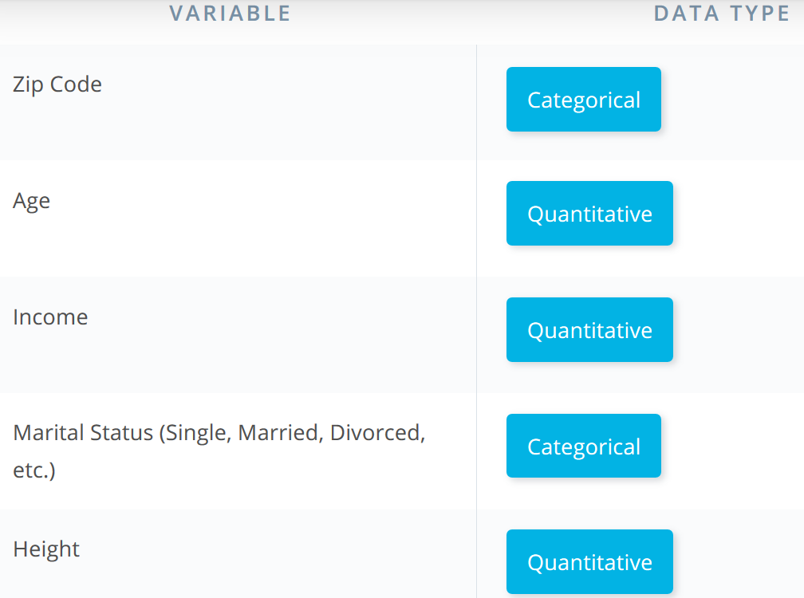
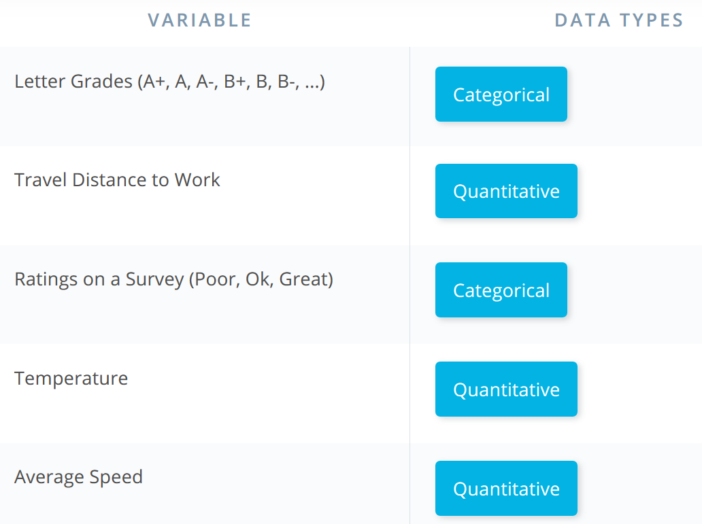
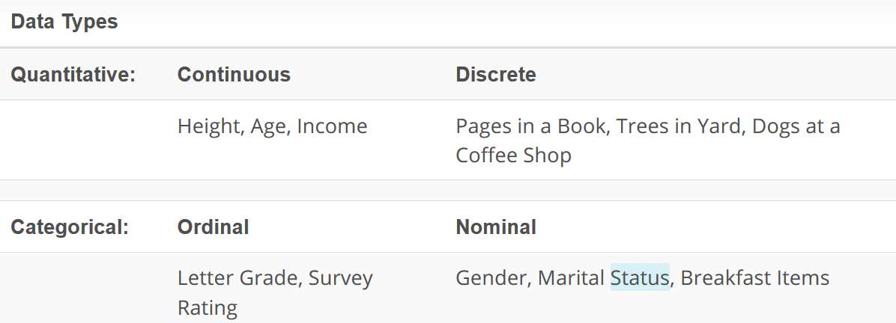
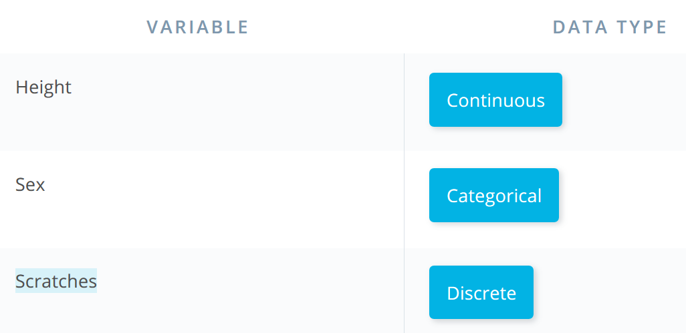

In this section, we looked at the different data types we might work with in the world around us. When we work with data in the real world, it might not be very clean - sometimes there are typos or missing values. When this is the case, simply having some expertise regarding the data and knowing the data type can assist in our ability to ‘clean’ this data. Understanding data types can also assist in our ability to build visuals to best explain the data. 

## The Four Levels of Measurement

In order to choose an appropriate plot type or method of analysis for your data, you need to understand the types of data you have. One common method divides the data into four levels of measurement:

### Qualitative or categorical types (non-numeric types)

   1. Nominal data: pure labels without inherent order like moving genre or country (no label is intrinsically greater or less than any other)

 
 

  

 2. Ordinal data: labels with an intrinsic order or ranking like letter grade on a test(comparison operations can be made between values, but the magnitude of differences are not be well-defined)

 
 

### Quantitative or numeric types

   3. Interval data: numeric values where absolute differences are meaningful (addition and subtraction operations can be made)
   
    
 

   

 4. Ratio data: numeric values where relative differences are meaningful (multiplication and division operations can be made)
 

   

All **quantitative-type** variables also come in one of two varieties: **discrete and continuous**.

  * Discrete quantitative variables can only take on a specific set values at some maximum level of precision.
  
  
  * Continuous quantitative variables can (hypothetically) take on values to any level of precision.

Distinguishing between continuous and discrete can be a little tricky – a rule of thumb is if there are few levels, and values can't be subdivided into further units, then it's discrete. Otherwise, it's continuous. If you have a scale that can only take natural number values between 1 and 5, that's discrete. A quantity that can be measured to two digits, e.g. 2.72, is best characterized as continuous, since we might hypothetically be able to measure to even more digits, e.g. 2.718. A tricky case like test scores measured between 0 and 100 can only be divided down to single integers, making it initially seem discrete. But since there are so many values, such a feature is usually considered as continuous.
 

   
When exploring your data, the most important thing to consider first is whether your data is qualitative or quantitative. In later lessons, you will see how this distinction impacts your choice of plots.

### Example:

You know your variables! The zip code is tricky. Even though this is a number, it isn't a number with which we can perform mathematical operations (add, subtract, etc.) and get another value that makes sense. Therefore, we consider it a categorical variable, not quantitative. 

### Example:

### Example:

### Example:

### Quantitative vs. Categorical

Some of these can be a bit tricky - notice even though zip codes are a number, they aren’t really a quantitative variable. If we add two zip codes together, we do not obtain any useful information from this new value. Therefore, this is a categorical variable.

**Height, Age, the Number of Pages in a Book and Annual Income** all take on values that we can **add, subtract and perform other operations** with to gain useful insight. Hence, these are **quantitative**.

**Gender, Letter Grade, Breakfast Type, Marital Status, and Zip Code** can be thought of as **labels for a group of items or individuals**. Hence, these are **categorical**.

### Continuous vs. Discrete

To consider if we have **continuous or discrete** data, we should see if we can split our data into smaller and smaller units. Consider time - we could measure an event in **years**, months, days, hours, minutes, or seconds, and even at seconds we know there are smaller units we could measure time in. Therefore, we know this data type is **continuous**.

**Height, age, and income** are all examples of **continuous** data. 

Alternatively, **the number of pages in a book**, **dogs** I count outside a coffee shop, or trees in a yard are **discrete** data. We would not want to split our dogs in half.

### Ordinal vs. Nominal

In looking at categorical variables, we found **Gender, Marital Status, Zip Code and your Breakfast items** are **nominal variables** where there is **no order ranking** associated with this type of data. Whether you ate cereal, toast, eggs, or only coffee for breakfast; there is no rank ordering associated with your breakfast.

Alternatively, the **Letter Grade or Survey Ratings** have a **rank ordering** associated with it, as **ordinal data**. If you receive an A, this is higher than an A-. An A- is ranked higher than a B+, and so on... **Ordinal variables** frequently occur on **rating scales** from very poor to very good. In many cases we turn these ordinal variables into numbers, as we can more easily analyze them, but more on this later!
