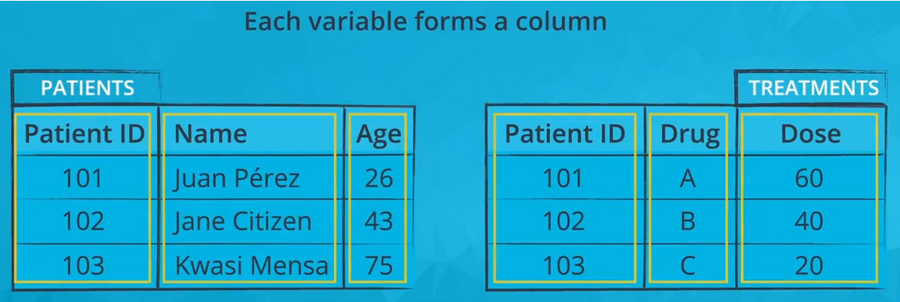
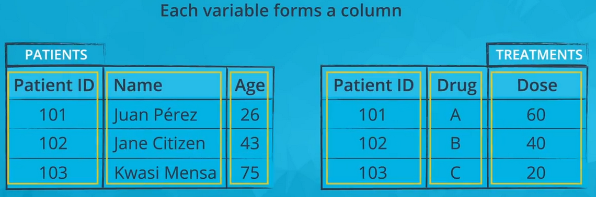
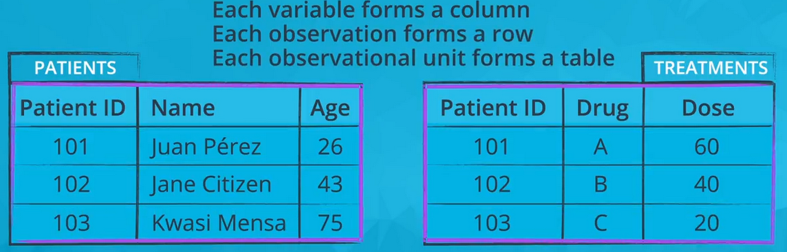
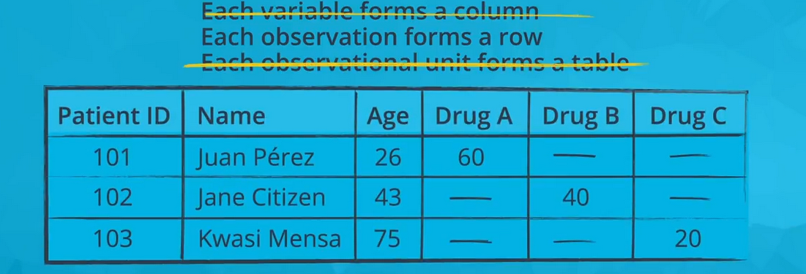

# Univariate Exploration of Data

We start our exploration of a dataset with univariate visualizations or visualizations of single variables.By looking at one variable at a time, we can build an intuition for how each variable is distributed before moving on to more complicated interactions between variables. 

This sections will focus on two different plot types, **bar charts for qualitative variables** and **histograms for quantitative variables**.  While both of these plot types take the appearance of rectangles on a pair of axes, you will see how datatype makes these plots distinct. 

# What is Tidy Data?

In this section, it is expected that your data is organized in some kind of tidy format. In short, a [tidy dataset](https://cran.r-project.org/web/packages/tidyr/vignettes/tidy-data.html) is a tabular dataset where:

   * each variable is a column
   * each observation is a row
   *each type of observational unit is a table

The first three images below depict a tidy dataset. This tidy dataset is in the field of healthcare and has two tables: one for patients (with their patient ID, name, and age) and one for treatments (with patient ID, what drug that patient is taking, and the dose of that drug).

 

  
 

                              
                                    Each variable in a tidy dataset must have its own column.
 
 

  
 

 
                                    Each observation in a tidy dataset must have its own row
 

  
 

 
                                    Each observational unit in a tidy dataset must have its own table

The next image depicts the same data but in one representation of a non-tidy format (there are other possible non-tidy representations). The Drug A, Drug B, and Drug C columns should form one 'Drug' column, since this is one variable. The entire table should be separated into two tables: a patients table and a treatments table.

 

  
 

 
Only the second rule of tidy data is satisfied in this non-tidy representation of the above data: each observation forms a row

While the data provided to you in the section will all be tidy, in practice, you may need to perform tidying work before exploration. You should be comfortable with reshaping your data or perform transformations to split or combine features in your data, resulting in new data columns. This work should be performed in the wrangling stage of the data analysis process.

**Notice: tidy data is not the only useful form that data can take.In fact, as you work with a dataset, you might need to summarize it in a non-tidy form in order to generate appropriate visualizations.**

# Bar Charts

A **bar chart** is used to depict the distribution of **a categorical** variable. In a bar chart, each level of the categorical variable is depicted with a bar, whose height indicates the **frequency of data points** that take on that level. A basic bar chart of frequencies can be created through the use of **seaborn's countplot** function check [this notebook](https://github.com/A2Amir/Data-Visualization-in-Data-Science-Process/blob/master/Code/Bar%20Charts.ipynb) to get more familiar.

# Absolute vs. Relative Frequency

By default, **seaborn's countplot** function will summarize and plot the data in terms of **absolute frequency**, or pure counts. In certain cases, you might want to understand the distribution of data or want to compare levels in terms of **proportions of the whole**. In this case, you will want to plot the data in terms of **relative frequency**, where the height indicates the proportion of data taking each level, rather than the absolute count. check [this notebook](https://github.com/A2Amir/Data-Visualization-in-Data-Science-Process/blob/master/Code/Absolute%20vs.%20Relative%20Frequency.ipynb) to get more familiar.

# Counting Missing Data

One interesting way we can apply bar charts is through the visualization of missing data. We can use pandas functions to create a table with the number of missing values in each column.check [this notebook](https://github.com/A2Amir/Data-Visualization-in-Data-Science-Process/blob/master/Code/Counting%20Missing%20Data.ipynb) to get more familiar.

# Pie Charts

A pie chart is a common univariate plot type that is used to depict relative frequencies for levels of a categorical variable. Frequencies in a pie chart are depicted as wedges drawn on a circle: the larger the angle or area, the more common the categorical value taken.check [this notebook](https://github.com/A2Amir/Data-Visualization-in-Data-Science-Process/blob/master/Code/Pie%20Charts.ipynb) to get more familiar.

# Histograms

A histogram is used to plot the distribution of a numeric variable. It's the quantitative version of the bar chart. However, rather than plot one bar for each unique numeric value, values are grouped into continuous bins, and one bar for each bin is plotted depicting the number.check [this notebook](https://github.com/A2Amir/Data-Visualization-in-Data-Science-Process/blob/master/Code/Histograms.ipynb) to get more familiar.

# Figures, Axes, and Subplots

The base of a visualization in matplotlib is a Figure object. Contained within each Figure will be one or more Axes objects, each Axes object containing a number of other elements that represent each plot.check [this notebook](https://github.com/A2Amir/Data-Visualization-in-Data-Science-Process/blob/master/Code/Figures%2C%20Axes%2C%20and%20Subplots.ipynb) to get more familiar.

# Choosing a Plot for Discrete Data
If you want to plot a discrete quantitative variable, it is possible to select either a histogram or a bar chart to depict the data.check [this notebook](https://github.com/A2Amir/Data-Visualization-in-Data-Science-Process/blob/master/Code/Choosing%20a%20Plot%20for%20Discrete%20Data.ipynb) to get more familiar.
