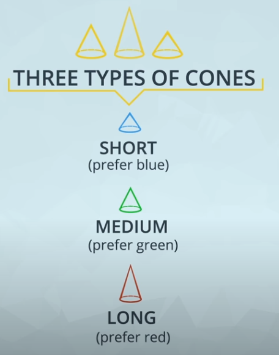
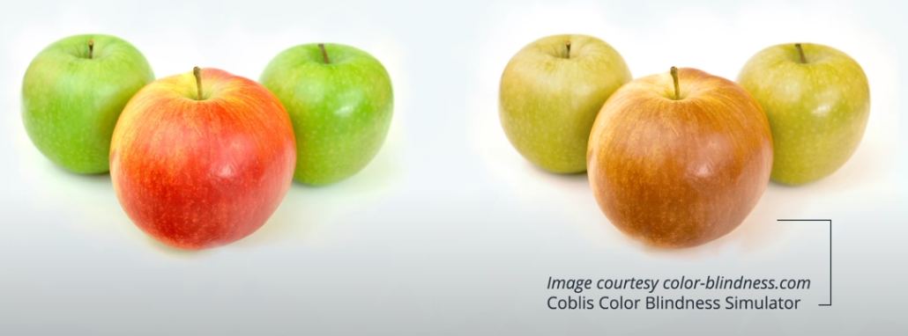


# Using Color

Color is an important tool in visualizations and it's important to use it appropriately to have the largest impact. Color can both help and hurt a data visualization. Three tips for using color effectively.

   1. Before adding color to a visualization, start with black and white.Many times, black, white and shades of grey will be enough to effectively convey your information. 

   2. When using color, use less intense colors such as natural colors or pastels.  - not all the colors of the rainbow, which is the default in many software applications. Colors with higher gray values have a softer feel and the eye can concentrate on them for longer periods of time. 

   3. Color for communication. Use color to highlight your message and separate groups of interest. Don't add color just to have color in your visualization.

# Designing for Color Blindness
Humans perceive color through signals produced by cells in the retina called cones. Light comes into the eye, hits the cones and the cones set off electrical signals to the brain. There are typically three types of cones, S,
M and L, for short, medium and long. They are sensitive to different frequencies or colors of light. Short cones prefer blue,
medium prefer green and long prefer red. 

 

  
 

 However around 10% of men and 1% of women, have mutations that affect these cones and produce what is known as colorblindness. 

 The most common form,is a red green colorblindness,typically caused by the medium cone shifting sensitivity towards red light. People with this condition can't distinguish between red and green
There is actually a pretty large fraction of people that are colorblind.as shown in the below image of a red and a green apple.
So you should design your visualizations to include them. Try to stay away from red green palettes and use blue orange instead.

 

  
 

To be sensitive to those with colorblindness, you should use color palettes that do not move from red to green without using another element to distinguish this change like shape, position, or lightness. Both of these colors appear in a yellow tint to individuals with the most common types of colorblindness. Instead, use colors on a blue to orange palette.
