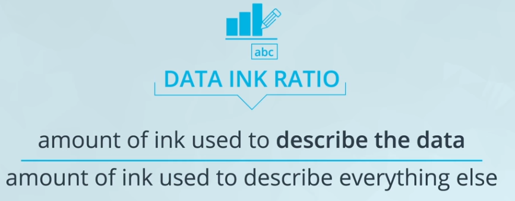
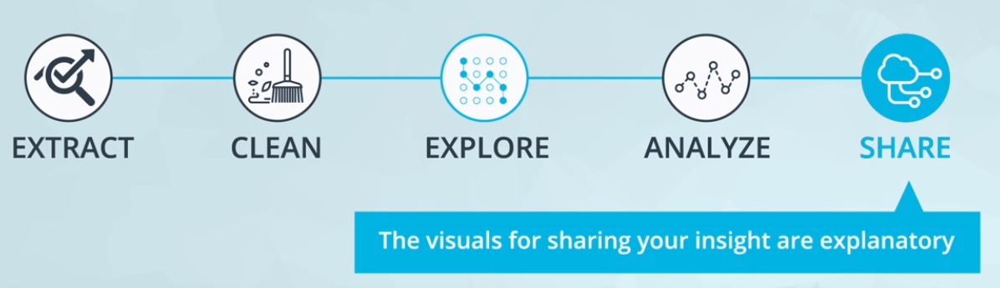

# What Experts Say About Visual Encodings 

Experts and researchers have determined the types of visual patterns that allow humans to best understand certain information. In general, humans are able to best understand data encoded with **positional changes (differences in x- and y- position as  scatterplots)** and **length changes (differences in box heights as  bar charts and histograms)**.

Alternatively, humans struggle with understanding data encoded with **color hue changes** (as are unfortunately commonly used as an additional variable encoding in scatter plots) and **area changes** (as pie charts, which often makes them not the best plot choice).

# Chart junk

From Wikipedia, [Chart junk](https://en.wikipedia.org/wiki/Chartjunk) refers to all visual elements in charts and graphs that are not necessary to comprehend the information represented on the graph or that distract the viewer from this information.

Examples of chart junk include:

   * Heavy grid lines
   * Unnecessary text
   * Pictures surrounding the visual
   * Shading or 3d components
   * Ornamented chart axes

# Data-ink ratio
As you know, we can better our visualizations by removing extraneous elements. We can conceptualize this relationship using something called the data-to-ink ratio. As the ratio of the amount of ink used to describe the data to the total amount of ink in the visual.
In general, the higher the data-to-ink ratio, the better (Limiting chart junk increases the data-ink ratio.). 
 
 

  
 

The **data-ink ratio**, credited to Edward Tufte, is directly related to the idea of chart junk. The more of the ink in your visual that is related to conveying the message in the data, the better. This means that a large amount of the ink in the visual is being used to actually describe the data, while low data-ink ratio suggests that you are using ink that is added for other purposes rather than describing the data. These elements should be removed. Let's take a look at an example. 
 
  

  
 

 
 As  you can easily see the effect of improving the data-to-ink ratio.The visualization with the high data-to-ink ratio(on the right side) is far more clear, more interpretable, and has all the elements you need for a great visualization. 
